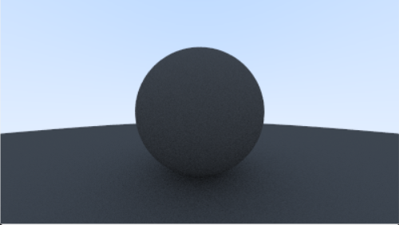

# Building a Basic Ray Tracing System with C++

This project implements a basic ray tracing engine in C++ that simulates light rays to render 3D scenes. It features support for spheres, various materials (diffuse, metal, dielectric), and generates high-quality images through accurate light simulation.

The ray tracer outputs images in the PPM (Portable Pixmap) format, which can be viewed with standard image viewers or converted to other formats.

## Sample Output

